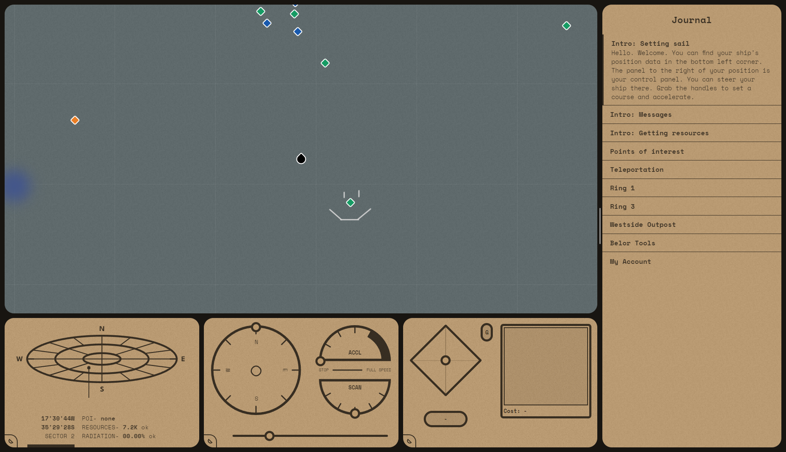

# space.maanex.me

space.maanex.me is an experimental game / experience / website / weekend project / whatever whenever.

You control a spaceship-like object through various weird control panels to find resources, messages left by other people and potentially more.

This experience is online and realtime.

It's built using nuxt and deployed as a jamstack application with a static frontend and a websocket serving backend.

Unless I had to take it down due to abuse, you can try it out live at https://space.maanex.me/

### License

Please contact me if you'd like to use code, assets, or anything else from this repo. Thanks!
